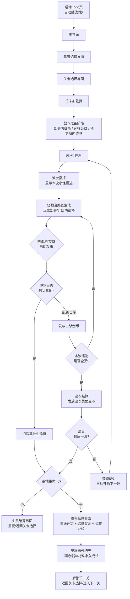

# 《Home Defense war》产品需求文档（PRD）

> 中文名：《家园保卫战》（沿用 GDD 版本命名；如与项目最终定名冲突，删除本行即可）

<style>
table { font-family: "SimSun", "宋体", "Songti SC", serif; border-collapse: collapse; }
table th, table td { text-align: center; vertical-align: middle; }
</style>

**版本**：V1.5 **日期**：2026年08月02日 **负责人**：游戏策划 / 游戏音频工程师 **所属项目**：Home Defense war 塔防项目

## 一、文档概述

### 1\.1 文档目的

本文档为《Home Defense war》（中文名：家园保卫战）的正式落地版产品需求文档，明确游戏核心玩法、全系统规则、关卡配置、怪物数值、防御塔体系、英雄系统、交互标准、美术规范等全维度开发需求，是程序开发、美术设计、测试验证、项目管控的唯一核心依据。所有开发环节需严格遵循本文档约定的规则与配置，数值类参数以配套飞书表格为准。

### 1\.2 文档范围

本文档覆盖游戏**核心战斗系统、防御塔系统、英雄系统、关卡系统、怪物系统、数值体系、UI交互、新手引导**的完整落地设计，包含8个关卡的全波次配置、16种怪物的属性与美术定义、4种基础防御塔的全等级规则、2个初始英雄的技能体系、BOSS技能量化标准、双路径执行细则、全流程UI跳转逻辑等核心内容。
本文档配套关联飞书表格配置库，所有数值类配置以对应配置表为准（配置库由策划维护，详见附录13.1）。

### 1\.3 术语定义

|术语|定义|
|---|---|
|波次|关卡中怪物的单次生成批次，是关卡推进的核心单位|
|双路径关卡|关卡存在2条怪物行进路径，奇数波怪物从A入口生成，偶数波怪物从B入口生成|
|混合杂兵波|程序按对应章节的怪物池随机分配怪物种类的波次，无需单独配置怪物ID|
|精英怪物|属性高于普通小怪、拥有特殊属性的怪物，血量/伤害显著高于同场景小怪|
|BOSS怪物|关卡关底核心怪物，拥有专属技能、极高属性，击败后通关对应关卡|
|开局延迟|波次第一只怪物生成的延迟时间，单位为秒|
|生成间隔|同波次内，相邻两只怪物的生成间隔时间，单位为秒|
|物理伤害|防御塔/英雄造成的物理类型伤害，受怪物物理护甲减免|
|魔法伤害|防御塔/英雄造成的魔法类型伤害，受怪物魔法抗性减免|
|状态效果|防御塔/BOSS/英雄施加的增减益效果，含眩晕、减速、灼烧、冻结等|
|目标优先级|防御塔/英雄锁定攻击目标的判定规则|
|英雄|玩家可全图移动的辅助单位，遇怪自动普攻，并拥有专属主动技能与冷却|

### 1\.4 参考资料

1. 《Home Defense war》关卡波次配置总表 \- 

2. 《Home Defense war》怪物索引表 \- 

3. 《Home Defense war》关卡总基础参数表 \- 

4. 《Home Defense war》防御塔配置表 \- 

5. 《Home Defense war》美术资源\&交互流程清单 \- 

### 1\.5 修订记录

|版本号|修订日期|修订人|修订内容|
|---|---|---|---|
|V1\.0|2025\-12\-20|游戏策划|完成PRD初版，覆盖全关卡、全怪物核心框架|
|V1\.1|2025\-12\-25|游戏策划|补充防御塔系统、战斗数值公式、经济细则、BOSS量化参数、UI交互规范、新手引导、美术规范、验收标准，完善落地性|
|V1\.2|2025\-12\-26|游戏策划|整合交互流程图、美术资源清单、全关卡波次配置表，新增英雄系统，完善全流程UI跳转逻辑、防御塔全等级规则、怪物美术规格、BOSS技能细节、全关卡波次明细，查漏补缺完成最终落地版|

|V1.3|2026-08-02|游戏策划|更名《Home Defense war》；移除表格链接；表格宋体居中；总览改细化流程图；削弱二三阶塔；英雄改全图移动自动攻击；波间5秒自动；新增地图占用/移动平滑/塔攻击机制/波次数量与经济平衡/波次播报/英雄局外培养/局内道具与结算奖励|
|V1.4|2026-08-02|游戏策划|吸收 GDD 版本中考虑周到的细节：补充中文名《家园保卫战》、英雄技能明确“无视防御塔的攻击限制”；GDD 旧版强塔数值/3秒波间/英雄不可移动/表格链接/非宋体等因与 V1.3 修改意见冲突，未反向合并|
|V1.5|2026-08-02|游戏音频工程师|整合《游戏音频系统设计文档》V1.0 为第十四章音频系统设计，按 FMOD 中间件架构定义声音身份、状态映射、SFX 目录、自适应音乐、2D 空间音频、性能预算与原生集成方案，与 V1.4 对齐|

## 二、产品概述

### 2\.1 产品定位

《Home Defense war》是一款**像素风格的单人塔防类游戏**，主打章节式关卡推进、策略性塔防布局、渐进式难度挑战，核心用户为塔防游戏爱好者、像素风格游戏受众，目标是打造一款玩法经典、难度曲线平滑、关卡设计丰富的轻量化塔防产品。

### 2\.2 核心玩法

玩家通过在关卡的可建造塔位上部署防御塔，搭配主动释放的英雄技能，阻止怪物沿路径进攻基地；每一关分为多个波次，完成全部波次防守且基地生命值未归零则通关；通关后可解锁下一章节关卡，逐步挑战更高难度的怪物与关卡机制。

### 2\.3 目标用户

1. 核心用户：18\-35岁塔防游戏核心玩家，追求策略性与挑战难度

2. 泛用户：像素风格游戏爱好者、休闲策略游戏玩家，偏好轻量化、关卡式推进的游戏体验

### 2\.4 游戏全流程总览



失败流程：基地生命值归零 → 失败结算界面 → 重玩/返回关卡选择

## 三、核心系统设计

### 3\.1 战斗系统

#### 3\.1\.1 核心规则

怪物沿固定路径向基地行进，玩家部署的防御塔自动锁定范围内怪物进行攻击，英雄可全图移动、遇怪自动普攻、并可主动释放技能辅助战斗；怪物到达基地会扣除基地生命值，生命值归零则关卡失败。

#### 3\.1\.2 伤害计算公式

1. **物理伤害最终值** = 防御塔/英雄物理伤害 × \(1 \- 怪物物理护甲减免比例\)

    - 护甲减免公式：减免比例 = 物理护甲 / \(物理护甲 \+ 100\)

    - 示例：怪物护甲50，减免比例=50/150≈33\.3%

2. **魔法伤害最终值** = 防御塔/英雄魔法伤害 × \(1 \- 怪物魔法抗性减免比例\)

    - 抗性减免公式同护甲规则

3. 伤害浮动范围：±10%，随机取整

4. 最小伤害：最终伤害≥1，避免护甲过高出现无伤情况

#### 3\.1\.3 状态效果统一规则

|效果类型|效果说明|叠加规则|免疫说明|
|---|---|---|---|
|眩晕|防御塔/怪物暂停所有动作，无法攻击/移动|不可叠加，取最长持续时间|BOSS免疫眩晕效果|
|减速|降低怪物移动速度|不可叠加，取最高减速比例|飞行怪物免疫地面减速效果|
|灼烧|每秒造成固定魔法伤害|可叠加，每层独立计算持续时间|无通用免疫|
|冻结|完全暂停怪物移动，受到伤害提前解冻|不可叠加，持续时间内无法被减速|BOSS免疫冻结效果|

#### 3\.1\.4 飞行单位专属规则

1. 行进逻辑：飞行怪物沿对应地面路径的上空飞行，行进路线、总长度与地面怪物完全一致

2. 攻击限制：仅**箭塔、魔法塔、英雄技能**可攻击飞行单位；炮塔、冰霜塔无法锁定与攻击飞行单位

3. 效果免疫：飞行怪物免疫所有地面减速效果（冰霜塔减速无效），仅受魔法类控制效果影响

#### 3\.1\.5 波次机制

1. 关卡按预设波次顺序推进，当前波次所有怪物全部击杀或到达基地后，自动进入波次结算

2. 波次结算后，默认有5秒波间间隔，间隔结束后自动开启下一波次的开局延迟计时

3. 玩家可手动点击“提前开波”按钮，跳过波间间隔与开局延迟，立即生成下一波怪物，并获得额外金币奖励

4. BOSS波次固定配置：生成数量=1，生成间隔=0，开局延迟≥2秒，确保BOSS在波次开始后延迟登场，给玩家预留准备时间

#### 3\.1\.6 BOSS战斗专属机制

1. BOSS波次开启时，先触发全屏BOSS进场提示，再执行BOSS入场与技能循环

2. BOSS拥有专属技能循环，入场后按固定CD释放技能，血量降至特定阈值时释放强化专属技能

3. BOSS技能释放前必须有对应预警特效，给玩家预留反应时间

4. BOSS被击杀后，立即停止所有技能循环，播放死亡动画，发放通关奖励

#### 3\.1\.7 胜利/失败条件

- 胜利：完成关卡全部波次防守，基地生命值＞0

- 失败：基地生命值归零，或玩家主动退出关卡

### 3.1.8 怪物移动平滑规范

1. 移动采用**帧率无关的连续插值**：怪物坐标按 位置 += 移速 × 帧间隔时间(dt) 逐帧累加，禁止整数格跳跃式步进，确保移动连贯顺滑。
2. 客户端目标稳定 **60FPS**，最低不低于 **30FPS**；移动逻辑以固定步长(1/60s)推进，渲染按实际帧率插值，逻辑与渲染解耦。
3. 怪物沿道路中心线以**浮点坐标**行进，渲染位置与逻辑位置分离，避免卡顿与抖动。
4. 采用**对象池**复用怪物与弹道实例，避免频繁创建/销毁造成的掉帧。
5. 同屏怪物数量超过 [PLACEHOLDER · 待性能实测] 只时，启动动态降级（降低非关键特效/阴影），保证流畅度。

### 3\.2 防御塔系统

#### 3\.2\.1 防御塔总览

当前版本共4种基础防御塔，覆盖物理/魔法、单体/群体、输出/控制、对地/对空的完整定位，形成怪物\-防御塔克制体系。所有防御塔最高可升至3级，每级属性与外观均有差异化升级。

|塔ID|塔名称|伤害类型|攻击模式|攻击目标|核心定位|
|---|---|---|---|---|---|
|1001\-1003|箭塔|物理|单体快速攻击|地面\+飞行|基础输出，对空主力，攻速快|
|1004\-1006|魔法塔|魔法|单体魔法攻击|地面\+飞行|高伤输出，克制高护甲单位，对亡灵增伤|
|1007\-1009|炮塔|物理|范围AOE攻击|仅地面|群体输出，克制密集小怪波次|
|1010\-1012|冰霜塔|魔法|单体控制攻击|仅地面|控制辅助，降低怪物移速，附带冻结效果|

#### 3\.2\.2 防御塔全等级属性与美术规范

|塔ID|塔名称|等级|像素尺寸|动画规格|伤害值|攻速（次/秒）|射程（格）|建造/升级费用|核心特性|
|---|---|---|---|---|---|---|---|---|---|
|1001|箭塔|1级|32×48|待机4帧/攻击6帧|15|1.2|3|建造50金币|基础物理塔，可攻击飞行单位|
|1002|箭塔|2级|32×56|待机4帧/攻击6帧|21|1.32|3.5|升级50金币|伤害+攻速小幅提升，箭矢附带穿透效果|
|1003|箭塔|3级|32×64|待机4帧/攻击8帧|27|1.44|4|升级100金币|终极形态，多重射击，同时攻击2个目标|
|1004|魔法塔|1级|32×48|待机4帧/施法6帧|25|0.8|2.5|建造80金币|魔法伤害塔，无视20%护甲，对亡灵单位增伤20%|
|1005|魔法塔|2级|32×56|待机4帧/施法6帧|35|0.88|3|升级80金币|伤害提升，附带0.5格小幅溅射效果|
|1006|魔法塔|3级|32×64|待机4帧/施法8帧|45|0.96|3.5|升级160金币|终极形态，范围魔法爆发，命中目标减速15%，持续2秒|
|1007|炮塔|1级|40×48|待机4帧/开炮8帧|40|0.5|2.5|建造100金币|高物理伤害范围塔，攻速慢，无法攻击飞行单位，AOE半径0.8格|
|1008|炮塔|2级|40×56|待机4帧/开炮8帧|56|0.55|3|升级100金币|伤害+爆炸范围提升，攻击目标降低30%护甲，持续3秒|
|1009|炮塔|3级|40×64|待机4帧/开炮10帧|72|0.6|3.5|升级200金币|终极形态，熔岩炮弹，造成伤害后附带每秒8点灼烧，持续3秒|
|1010|冰霜塔|1级|32×48|待机4帧/攻击6帧|8|1.0|2|建造60金币|控制塔，伤害低，命中目标减速30%，持续2秒|
|1011|冰霜塔|2级|32×56|待机4帧/攻击6帧|11|1.1|2.5|升级60金币|减速效果增强至45%，持续2秒，附带10%概率冻结1秒|
|1012|冰霜塔|3级|32×64|待机4帧/攻击8帧|14|1.2|3|升级120金币|终极形态，范围冰冻，每4秒对范围内所有地面怪物冻结1秒|

#### 3\.2\.3 升级与出售规则

1. **升级等级**：每座防御塔最高可升至3级，升级需消耗对应金币，升级后属性与外观即时更新

2. **出售规则**：出售返还累计投入金币的70%（建造\+升级总费用），向下取整；出售后塔立即消失，停止所有攻击与效果

3. 升级、出售操作仅可在战斗进行中/暂停时执行，波次结算阶段无限制

#### 3\.2\.4 攻击逻辑细则

1. 目标锁定：防御塔进入射程的怪物，按自身优先级规则锁定目标；目标离开射程后，重新锁定下一个目标

2. 目标优先级：

    - 箭塔/冰霜塔：最前方怪物

    - 魔法塔：血量最高怪物

    - 炮塔：最密集区域（范围内怪物数量最多的位置）

3. 弹道规则：箭塔、魔法塔为飞行弹道，弹道飞行速度=10格/秒；炮塔为抛物线弹道；冰霜塔为瞬时命中

4. AOE伤害：炮塔爆炸范围内所有地面怪物均受到全额伤害，无伤害衰减；魔法塔3级溅射伤害为50%

5. 攻击中断：防御塔被眩晕时，停止攻击与攻速计时，眩晕结束后恢复正常

### 3.2.5 防御塔攻击机制详解（蓄力 / 发射 / 弹道 / 逻辑）

|塔名称|蓄力时间|发射方式|发射物|弹速（格/秒）|攻击逻辑|
|---|---|---|---|---|---|
|箭塔|0.2s（开火前摇）|直线飞行弹道|箭矢（小型，命中即止）|12|锁定射程内最前方怪物，命中后伤害结算并消失；2级起箭矢穿透1个额外目标|
|魔法塔|0.3s（施法前摇）|直线魔法弹道|魔法弹（中型，命中爆裂）|10|锁定射程内血量最高怪物，命中产生0.5格溅射；3级触发范围魔法爆发|
|炮塔|0.4s（开炮前摇）|抛物线弹道|炮弹（大型，落点爆炸）|8（弧线）|锁定射程内怪物最密集位置，落点AOE全额伤害，无衰减|
|冰霜塔|0.15s（瞬时前摇）|瞬时光束|冰晶射线（命中即生效）|瞬时|锁定射程内最前方怪物，命中施加减速/冻结状态，无弹道飞行时间|

说明：
- 蓄力时间计入攻速间隔（实际攻击间隔 = 1/攻速 + 蓄力时间）。
- 发射物飞行期间目标若离场/死亡，箭塔/魔法塔弹道命中失效，炮塔落点仍按原轨迹爆炸。
- 所有发射物尺寸均 ≤ 1 单元格，不跨格渲染，避免与道路/塔位产生占用冲突。

### 3.3 英雄系统

#### 3.3.1 英雄总览

英雄是玩家可**全图移动**的辅助作战单位：玩家通过点击/拖拽指定移动目标，英雄在可行走格（草地+道路，遇塔绕行）上移动；当进入怪物射程时**自动普攻**最近怪物；同时保留专属主动技能（点击释放，有冷却）。当前版本开放2个初始英雄，后续可扩展。

|英雄ID|英雄名称|类型|核心定位|解锁条件|
|---|---|---|---|---|
|2001|王国游侠|物理远程|单体高爆发，对空特化|游戏初始解锁|
|2002|宫廷法师|魔法范围|范围清场，群体控制|完成第一章3003关卡解锁|

#### 3.3.2 英雄属性与技能规范

|英雄名称|像素尺寸|移动速度（格/秒）|普攻伤害|普攻射程（格）|普攻攻速（次/秒）|普攻目标|主动技能|技能量化规则|冷却时间|
|---|---|---|---|---|---|---|---|---|---|
|王国游侠|48×64|3.0|20（物理）|2.5|1.0|地面+飞行|穿透箭|对路径上所有怪物造成100%物理伤害，对飞行单位额外50%，可穿透护盾|15秒|
|宫廷法师|48×64|2.5|25（魔法）|2.5|0.8|地面+飞行|火焰雨|对指定区域内所有怪物造成每秒30%魔法伤害，持续3秒，区域内减速20%|20秒|

动作规格：王国游侠 待机/行走/普攻/蓄力射击/受击/死亡 各8帧；宫廷法师 待机/行走/施法/陨石术/受击/死亡 各8帧。

#### 3.3.3 英雄使用规则

1. 每个关卡选择1个已解锁英雄进入战斗，战斗中不可更换；英雄初始位于基地附近。
2. 移动：玩家点击战场空地，英雄自动寻路前往；移动仅在非塔格进行，遇塔自动绕行。
3. 自动普攻：英雄进入普攻射程后自动锁定最近怪物攻击，无需手动操作；离开射程停止。
4. 主动技能：点击英雄头像释放，进入冷却，冷却结束高亮可再次点击；技能对飞行单位生效，且无视防御塔的攻击限制（炮塔/冰霜塔的对空限制不适用于英雄技能）。
5. 英雄无血量、不被怪物攻击（避免操作负担），全程存在于战场，失败仅由基地生命归零判定。

### 3\.4 关卡系统

#### 3\.4\.1 关卡总览

游戏共设计3个章节、8个关卡，每个关卡拥有独立的基础参数、波次配置、场景主题，具体如下：

|关卡ID|关卡名称|所属章节|路径数量|波次总数|核心特性|
|---|---|---|---|---|---|
|3001|山口防线|第一章 边境防线|1|20|新手教学关，单路径，兽人小怪为主|
|3002|森林隘口|第一章 边境防线|2|22|双路径，奇数上路/偶数下路，前期精英怪登场|
|3003|矮人堡垒|第一章 边境防线|1|25|第一章关底BOSS，单路径，兽人队长登场|
|3004|枯骨墓地|第二章 亡灵荒地|1|21|亡灵主题开篇，单路径，亡灵小怪为主|
|3005|幽灵湖泊|第二章 亡灵荒地|2|23|双路径，大量飞行亡灵单位|
|3006|黑暗塔林|第二章 亡灵荒地|1|26|第二章关底BOSS，单路径，骷髅王登场|
|3007|熔岩通道|第三章 魔焰深渊|2|24|恶魔主题开篇，双路径，高护甲精英怪登场|
|3008|地狱之门|第三章 魔焰深渊|1|28|游戏最终关，单路径，最终BOSS地狱魔像登场|

#### 3\.4\.2 关卡基础参数明细

所有关卡固定基础参数如下，程序加载关卡时直接读取配置表：

|关卡ID|初始金币|基地生命值|可用塔位|路径长度（格）|解锁条件|
|---|---|---|---|---|---|
|3001|200|20|12|30|游戏初始解锁|
|3002|250|20|16|A路32 / B路31|完成3001关卡|
|3003|300|25|15|35|完成3002关卡|
|3004|280|20|14|32|完成3003关卡|
|3005|320|20|18|A路33 / B路33|完成3004关卡|
|3006|350|25|16|36|完成3005关卡|
|3007|380|20|17|A路34 / B路35|完成3006关卡|
|3008|400|30|18|40|完成3007关卡|

#### 3\.4\.3 波次配置字段规范

每一波次必须包含以下字段，配置表与程序读取严格对应：

|字段名|说明|取值示例|
|---|---|---|
|wave\_id|波次序号|1,2,3\.\.\.|
|monster\_type|怪物类型|固定ID / 混合杂兵 / BOSS|
|monster\_count|生成总数量|10, 20, 1|
|spawn\_interval|生成间隔（秒）|1\.0, 0\.8|
|start\_delay|开局延迟（秒）|2\.0, 0|
|path\_entry|入口路径|A / B / 无（单路径）|
|wave\_reward|波次完成奖励金币|30, 50|
|is\_boss|是否BOSS波|0 / 1|
|wave_desc|波次播报描述文本|如「兽人小兵来袭！」|

#### 3.4.3.1 波次播报描述示例

|波次类型|wave_desc 示例|设计目的|
|---|---|---|
|普通地面波|「兽人小兵成群逼近，箭塔已就位！」|提示玩家本波构成|
|飞行波|「飞行编队来袭！请部署对空火力（魔法塔/英雄）」|引导对空应对|
|精英波|「精英狼骑兵突进，注意高血量与冲锋！」|警示强度提升|
|BOSS波|「BOSS 兽人队长降临，震地眩晕预警！」|制造紧张与准备窗口|
|混合波|「杂兵混编潮，合理分配火力！」|提示策略|

#### 3\.4\.4 双路径关卡执行规则

所有双路径关卡（3002、3005、3007）严格遵循以下规则，程序硬编码实现：

1. 路径标识：固定为A入口（上路）、B入口（下路）

2. 波次匹配：奇数波次（1、3、5\.\.\.）怪物从A入口生成，偶数波次（2、4、6\.\.\.）怪物从B入口生成

3. 路径平衡：两条路径的怪物行进总时间误差≤5%，塔位分布均衡，可同时覆盖两条路径

4. 塔位规则：所有塔位为全局共用，防御塔攻击范围可同时覆盖两条路径的怪物

5. 当前版本暂不支持双线同步波次，后续迭代可扩展波次类型

### 3\.5 怪物系统

#### 3\.5\.1 怪物总览

游戏共16种怪物，分为普通小怪、精英怪物、飞行怪物、BOSS怪物四大类，分属兽人、亡灵、恶魔三大阵营，所有怪物拥有统一的ID、属性与美术规格。

|阵营|普通小怪|精英怪物|飞行怪物|BOSS|
|---|---|---|---|---|
|兽人|哥布林、兽人小兵|狼骑兵、暗影刺客、巨魔|石像鬼|兽人队长|
|亡灵|骷髅战士、僵尸|巫妖学徒、石傀儡|幽灵、飞行骷髅|骷髅王|
|恶魔|恶魔小鬼、地狱犬|炎魔卫士、重甲恶魔|双足飞龙|地狱魔像|

#### 3\.5\.2 怪物核心属性与美术规格（第一章基准）

|怪物ID|怪物名称|类型|像素尺寸|动画规格|生命值|伤害值|移速（格/秒）|物理护甲|魔法抗性|击杀金币|
|---|---|---|---|---|---|---|---|---|---|---|
|4001|哥布林|地面小怪|32×32|行走6帧/受击2帧/死亡4帧|80|1|1\.8|0|0|8|
|4002|兽人小兵|地面小怪|32×40|行走6帧/受击2帧/死亡4帧|100|1|1\.5|0|0|10|
|4003|狼骑兵|地面精英|48×40|行走8帧/受击2帧/死亡6帧|250|2|2\.0|15|5|40|
|4004|骷髅战士|地面小怪|32×36|行走6帧/受击2帧/死亡4帧|90|1|1\.4|5|0|12|
|4005|暗影刺客|地面精英|32×36|行走8帧/受击2帧/死亡6帧|200|2|2\.2|10|10|35|
|4006|石像鬼|飞行小怪|36×32|飞行8帧/受击2帧/消散4帧|120|1|1\.8|5|0|15|
|4007|巨魔|地面精英|48×56|行走6帧/受击2帧/死亡8帧|300|3|1\.2|20|10|50|
|4008|兽人队长|BOSS|96×96|行走8帧/普攻8帧/震地技能12帧/死亡12帧|3000|10|1\.0|50|30|300|

#### 3\.5\.3 章节属性缩放规则

1. 第二章怪物基础属性 = 第一章同类型怪物 × 1\.25（血量、伤害、护甲、抗性同步缩放）

2. 第三章怪物基础属性 = 第一章同类型怪物 × 1\.65

3. 同章节内，每5波怪物属性提升8%（血量、伤害同步提升）

4. 精英怪物属性 = 同章节普通小怪 × 2\.5；飞行怪物属性 = 同章节地面小怪 × 1\.5

5. BOSS怪物属性 = 同章节精英怪物 × 8\~10倍

#### 3\.5\.4 混合杂兵执行规则

混合杂兵波次程序无需配置单个怪物ID，按以下规则执行：

1. 从对应章节的普通怪物池中，随机抽取2\-3种怪物类型

2. 按波次总生成数量平均分配，无法整除时余数分配给第一种随机怪物

3. 生成顺序：按选中的怪物类型循环生成，保证怪物种类均匀分布

4. 生成间隔、开局延迟、入口路径、波次奖励按波次配置表执行

#### 3\.5\.5 BOSS技能量化参数

|BOSS ID|BOSS名称|专属技能|技能量化规则|
|---|---|---|---|
|4008|兽人队长|震地范围眩晕|1\. CD：10秒，首次释放入场后5秒触发<br>2\. 范围：以BOSS为中心，半径3格内所有防御塔<br>3\. 效果：眩晕2秒，暂停攻击<br>4\. 预警：释放前1秒，范围内显示红色预警圈|
|4012|骷髅王|召唤小骷髅|1\. CD：5秒，首次释放入场后3秒触发<br>2\. 召唤物：2只骷髅战士（属性为普通骷髅战士的80%）<br>3\. 上限：场上最多同时存在6只召唤物<br>4\. 召唤位置：BOSS身后1格路径上|
|4016|地狱魔像|周期性火焰冲击波|1\. CD：8秒，首次释放入场后6秒触发<br>2\. 范围：全路径两侧1格内所有防御塔<br>3\. 效果：使范围内防御塔攻速降低50%，持续3秒<br>4\. 预警：释放前2秒全屏火焰特效预警|

### 3\.6 经济系统

1. **初始金币**：关卡开局自动获得，数值按关卡基础参数表执行

2. **击杀金币**：击杀怪物获得对应金币，数值配置在怪物索引表中，金币即时到账并显示飘字

3. **波次奖励**：每波次完成后，固定发放波次奖励金币，数值见波次配置表

4. **提前开波奖励**：手动提前开启下一波，奖励=剩余波间时间×2金币/秒，不足1秒不计

5. **金币消耗**：建造、升级防御塔消耗金币；出售防御塔返还70%累计投入

6. **金币下限**：金币不可为负，金币不足时无法执行建造/升级操作，按钮置灰

### 3\.7 进度与星级系统

#### 3\.7\.1 关卡解锁规则

1. 完成当前章节的前一个关卡后，自动解锁下一个关卡

2. 完成章节关底BOSS关卡后，解锁下一章节的首个关卡

3. 解锁状态本地永久存储，卸载重装后丢失（后续迭代云端同步）

#### 3\.7\.2 星级评定规则

每个关卡通关后根据表现评定1\-3星：

- 3星：基地生命值无损耗（满血）通关

- 2星：基地剩余生命值≥50%通关

- 1星：基地剩余生命值＞0通关

- 星级取历史最高值，永久保存

- 星级作用：当前版本用于展示成就，后续迭代可关联奖励与难度解锁

### 3.8 地图格子与占用规范

为避免可建造塔位与道路之间出现间隙、以及实体占用冲突，全场统一采用 **32×32 像素单元格网格**，所有实体坐标对齐网格：

|对象|尺寸规则|占用规则|
|---|---|---|
|单元格|32×32 像素|最小空间单位，全场景统一|
|战场|标准 28列 × 16行 = 896×512 像素；长路径关可用 32×18|固定网格，UI自适应缩放|
|道路|宽度 = 1 单元格（32像素）连续车道|沿预设路径点连成，**无断裂、无变宽**，怪物在中心线连续行进|
|塔位|1 单元格（草地）|仅可建在**非道路且正交相邻至少1个道路格**的草地单元格，保证塔紧邻道路、射程覆盖且无间隙|
|防御塔|1 单元格|建造后该格锁定为塔占用，不可再建/不可为道路|
|怪物|1 单元格|沿道路中心线浮点坐标移动，不进入非道路格|
|英雄|1 单元格|可在任意非塔格（草地+道路）移动，遇塔阻挡绕行|

一致性与防缝隙规则：
1. 道路为连续 1 格宽车道，路径点间距对齐单元格，杜绝道路中段变宽/缩窄产生的缝隙。
2. 塔位由程序按“道路正交相邻草地格”自动生成，确保塔与道路零间隙贴合。
3. 所有生成、建造、移动均对齐 32×32 网格，禁止部分单元格重叠与悬空占位。

### 3.9 英雄局外培养系统

英雄在战斗外可通过积累的资源进行永久成长，以下数值为设计框架，具体曲线以 playtest 验证后填入（标注 [PLACEHOLDER]）：

|培养维度|获取方式|效果|上限/说明|
|---|---|---|---|
|英雄等级|每局结算获得英雄经验(EXP)|每级提升基础攻击+[PLACEHOLDER]%、移速+[PLACEHOLDER]%|暂定 1~30 级|
|技能升级|升级获得技能点|提升主动技能伤害/范围/CD（如游侠穿透箭伤害+[PLACEHOLDER]%）|每技能 5 级|
|天赋树|消耗天赋点（升级/里程碑获得）|分支：进攻/防御/辅助，提供被动加成|每分支 [PLACEHOLDER] 点|
|装备/符文|关卡掉落/活动获取|提供攻击、护甲、移速等属性加成|每个英雄 3 槽位|
|突破升星|消耗英雄碎片(结算掉落)|解锁新被动/提升属性上限|暂定 1~5 星|

货币来源：局内结算奖励、首通奖励、无伤奖励、活动。所有数值需经 playtest 调平，避免局外成长碾压关卡设计难度。

### 3.10 局内道具与结算奖励

#### 3.10.1 局内道具

战斗中可使用的消耗道具，缓解突发高压波次：

|道具名称|效果|获取方式|使用限制|
|---|---|---|---|
|炸弹|对指定范围内所有怪物造成 [PLACEHOLDER] 伤害|击杀掉落/波次奖励附带/金币购买|每局 [PLACEHOLDER] 个|
|急救包|恢复基地生命 +5|同上|同上|
|金币袋|立即获得 100 金币|同上|无|
|寒冰符|全场怪物减速 50%，持续 5 秒|同上|每局 [PLACEHOLDER] 个|
|援军图腾|临时召唤1座 [PLACEHOLDER] 级防御塔，持续 [PLACEHOLDER] 秒|同上|每局 [PLACEHOLDER] 个|

使用：战斗界面底部道具栏，点击使用，数量耗尽或冷却中置灰。

#### 3.10.2 结算奖励

每局结束（胜利/失败均可获得基础部分）发放：

|奖励项|规则|数值（[PLACEHOLDER] 待调）|
|---|---|---|
|基础奖励|通关固定金币|通关 +[PLACEHOLDER]；失败按进度比例发放|
|波次累计|按到达波次额外金币|每波 +[PLACEHOLDER]|
|星级奖励|3星 +50% / 2星 +30% / 1星 +10%|基于基础奖励乘算|
|首通奖励|首次通关额外发放|金币 +[PLACEHOLDER]、英雄经验 +[PLACEHOLDER]|
|无伤奖励|满血通关|英雄经验 +[PLACEHOLDER]、英雄碎片 +[PLACEHOLDER]|
|英雄经验|用于局外培养|每局 +[PLACEHOLDER]（随波次/星级浮动）|

失败结算仅发放基础奖励与已得英雄经验，不发放星级/首通/无伤奖励。

## 四、关卡详细设计与波次配置

### 4\.1 第一章 边境防线（新手章节）

#### 4\.1\.1 核心设计目标

面向新手玩家，熟悉游戏基础操作、防御塔功能、怪物基础机制，难度曲线平缓，无复杂机制，核心怪物为兽人阵营，逐步引入精英怪与第一章关底BOSS。

#### 4\.1\.2 3001 山口防线 波次核心配置

- 单路径，20波，纯兽人小怪为主

- 第1\-5波：纯哥布林/兽人小兵，引导新手建造箭塔

- 第10波：首次引入飞行小怪石像鬼，引导建造魔法塔

- 第15波：首次出现精英狼骑兵

- 第20波：BOSS兽人队长，新手检验关

- 内置完整新手引导流程

#### 4\.1\.3 3002 森林隘口 波次核心配置

- 双路径，22波，奇数波上路、偶数波下路

- 第3波起引入暗影刺客（高速低血精英）

- 第8波下路出现巨魔精英

- 第15\-20波：双路径交替高压，考验双线布防

- 第22波：上路精英混合波，章节过渡检验

#### 4\.1\.4 3003 矮人堡垒 波次核心配置

- 第一章关底，单路径，25波

- 第10波起出现混合杂兵波

- 第15、20波为精英密集波

- 第25波：BOSS兽人队长，拥有震地眩晕技能，第一章核心挑战

### 4\.2 第二章 亡灵荒地（进阶章节）

#### 4\.2\.1 核心设计目标

提升关卡难度，引入大量飞行亡灵单位，逼迫玩家建造对空防御塔，怪物以亡灵阵营为主，属性高于第一章，引入精英巫妖学徒、石傀儡，关底BOSS为骷髅王。

#### 4\.2\.2 3004 枯骨墓地 波次核心配置

- 单路径，21波，亡灵主题开篇

- 核心怪物：骷髅战士、僵尸、幽灵

- 第6波引入精英巫妖学徒（魔法远程，高魔法抗性）

- 第12波起出现飞行幽灵单位

- 第18波：亡灵混合杂兵潮

- 第21波：精英石傀儡登场，检验物理输出能力

#### 4\.2\.3 3005 幽灵湖泊 波次核心配置

- 双路径，23波，飞行单位占比≥40%

- 奇数波地面亡灵为主，偶数波飞行亡灵为主

- 第10波起双路径同时出现精英单位

- 考验对空防御塔布局与双线资源分配

#### 4\.2\.4 3006 黑暗塔林 波次核心配置

- 第二章关底，单路径，26波

- 石傀儡精英怪密度提升，混合杂兵波次占比60%

- 第20波起出现连续高压波次

- 第26波：BOSS骷髅王，拥有召唤小骷髅技能，第二章核心挑战

### 4\.3 第三章 魔焰深渊（高难度章节）

#### 4\.3\.1 核心设计目标

游戏最高难度章节，引入恶魔阵营怪物，高护甲精英怪\+飞行单位组合，考验玩家炮塔与控制防御塔的搭配能力，怪物属性全面提升，最终关为游戏终极BOSS地狱魔像。

#### 4\.3\.2 3007 熔岩通道 波次核心配置

- 双路径，24波，恶魔主题开篇

- 核心怪物：恶魔小鬼、双足飞龙、重甲恶魔

- 高护甲精英怪占比显著提升，考验魔法塔输出

- 双路径持续高压，精英波次间隔缩短

#### 4\.3\.3 3008 地狱之门 波次核心配置

- 游戏最终关，单路径，28波

- 怪物属性达到游戏峰值，混合杂兵潮、精英怪波次密集

- 第20波起连续8波高压，无喘息空间

- 第28波：最终BOSS地狱魔像，拥有周期性火焰冲击波技能，游戏终极挑战

### 4\.4 全关卡波次配置表

所有关卡完整波次配置详见飞书表格《关卡完整波次配置表》，包含每一波的怪物类型、数量、生成间隔、开局延迟、入口路径、奖励金币等全量参数。

## 五、数值体系设计

### 5\.1 难度梯度设计

游戏整体难度遵循**平缓提升、章节跃迁**的核心原则：

1. **第一章（新手）**：怪物属性低，波次间隔长，金币收益高，容错率高，核心让玩家熟悉玩法；预期新手通关率≥80%

2. **第二章（进阶）**：怪物属性提升25%，飞行单位占比提升，波次间隔缩短15%，容错率降低；预期平均通关重试次数1\-2次

3. **第三章（高难度）**：怪物属性提升65%，高护甲精英怪占比提升，波次密度提升30%，金币收益降低10%；预期平均通关重试次数3\-5次

### 5\.2 数值成长公式

1. **怪物波次成长**：同章节内，第N波怪物属性 = 基准属性 × \(1 \+ 0\.08 × floor\(\(N\-1\)/5\)\)

2. **防御塔升级成长**：第L级伤害 = 1级伤害 × (1 + 0.4 × (L-1))；攻速 = 1级攻速 × (1 + 0.1 × (L-1))

3. **经济平衡基准**：单关卡总预期金币收入 ≈ 最低通关建造成本 × 1\.3，保证30%容错空间

### 5\.3 数值微调规则

测试阶段可根据实际难度反馈，按以下规则进行数值微调，无需修改整体配置结构：

1. 难度偏高：统一下调对应章节怪物血量10%，或提升玩家初始金币10%

2. 难度过低：提升对应章节BOSS护甲10%，或提升精英怪物伤害10%

3. 飞行单位难度异常：调整飞行怪物移动速度、护甲值，或提升对空防御塔的伤害

4. 所有数值微调需同步更新飞书配置表，确保文档与程序配置一致

### 5.4 波次怪物数量成长与经济-战力平衡

#### 5.4.1 怪物数量成长

为制造“每几波加压”的体验，怪物数量随波次阶梯成长（具体数值 [PLACEHOLDER · 待 playtest 校准]）：

- 基础数量：每波基准怪物数 = 章节基准值（如第一章 8 只）。
- 线性增量：第 N 波数量 = 基准 × (1 + 0.06 × (N−1))，向上取整。
- 里程碑跳涨：每 5 波为里程碑，数量额外 +15%，制造阶段性高压。
- 示例（第一章，基准8）：第1波8 → 第5波约10 → 第10波约14(+15%里程碑≈16) → 第20波约24(+15%≈28)。

#### 5.4.2 经济-战力平衡模型

核心闭环：**击杀金币 → 建造/升级防御塔 → 提升DPS → 击杀更高血量波次**。需保证“认真游玩可过关、但容错有限”：

1. 单波总血量 H_wave(N) = Σ 怪物血量 × 数量（含章节/波次缩放）。
2. 单波可用时间 T_wave ≈ 路径长度 / 移速 + 生成间隔 × 数量（[PLACEHOLDER] 按实测）。
3. 所需 DPS_req(N) = H_wave(N) / T_wave。
4. 玩家金币收入 G(N) = 初始金币 + 累计击杀金币 + 累计波次奖励 + 提前开波奖励。
5. 可购 DPS_avail(N) = f(G(N), 塔单价, 塔DPS) —— 即金币能转化的总输出。
6. 平衡判据：DPS_avail(N) ≥ DPS_req(N) × 1.15（留15%容错），且不应 ≥ DPS_req × 1.6（否则过易）。
7. 所有系数与基准值均为 [PLACEHOLDER]，上线前需经 3 轮数值校验与核心玩家试玩调平。

## 六、UI与交互设计

### 6\.1 全流程UI跳转逻辑

```Plaintext
启动Logo页（自动播放2秒） → 主界面
主界面可跳转：
  → 章节选择界面 → 关卡选择界面 → 关卡加载页 → 战斗界面
  → 英雄列表界面 → 英雄详情界面
  → 设置界面
  → 退出确认弹窗 → 关闭游戏
战斗界面可跳转：
  → 暂停菜单 → 返回关卡选择/重玩/设置
  → 胜利结算界面 → 下一关/重玩/返回关卡选择
  → 失败结算界面 → 重玩/返回关卡选择
```

### 6\.2 核心界面布局与交互规则

#### 6\.2\.1 主界面

- 顶部：游戏LOGO

- 中部：「开始游戏」「英雄图鉴」「设置」按钮（竖向排列）

- 底部：版本号

- 交互：点击按钮对应跳转对应界面；点击退出游戏弹出确认弹窗

#### 6\.2\.2 章节/关卡选择界面

- 顶部：返回按钮、章节标题

- 中部：章节地图，关卡节点按顺序排列

- 未解锁关卡：灰色锁图标，不可点击

- 已通关关卡：显示最高星级

- 交互：点击已解锁关卡进入关卡加载界面；点击返回回到上一级界面

#### 6\.2\.3 战斗界面

- **顶部状态栏**（从左到右）：返回按钮、金币数量、基地生命值（血条\+数字）、当前波次/总波次

- **底部建造栏**：4种防御塔图标\+造价，金币不足时图标置灰

- **右侧功能栏**（从上到下）：下一波按钮、1x/2x倍速切换、暂停按钮

- **英雄技能栏**：左下角英雄头像，点击释放技能，冷却中显示CD倒计时

- **塔位交互**：

    - 点击空塔位：弹出建造面板，显示可建造的防御塔及价格

    - 点击已建造的塔：弹出操作面板，显示升级（含费用）、出售（含返还金币）、属性信息

- **波次播报**：每波开始时屏幕顶部居中显示该波怪物描述（wave_desc），持续约2秒后淡出
- **反馈特效**：金币飘字、伤害数字、怪物死亡特效、基地受击震动、技能释放特效

#### 6\.2\.4 结算界面

- 中部：通关/失败标题、星级展示（仅胜利界面）、通关数据（击杀数、剩余血量、用时）

- 底部：「重试」「下一关」（仅胜利界面）「返回关卡选择」按钮

- 失败界面不显示星级，仅展示失败原因与重试按钮

### 6\.3 核心交互规则

1. 建造防御塔：点击空塔位→选择防御塔→扣除金币→塔立即生成并进入战斗状态

2. 升级防御塔：点击已建塔→点击升级→扣除金币→塔升级完成，属性即时生效

3. 暂停：点击暂停按钮，游戏完全暂停，怪物停止移动、防御塔停止攻击、英雄技能CD暂停；暂停时可进行建造/升级/出售操作

4. 倍速：支持1倍、2倍切换，倍速影响怪物移动、防御塔攻击、技能CD所有时间逻辑

5. 英雄技能：点击英雄头像释放技能，释放后进入冷却，冷却结束后头像高亮可再次点击

6. 所有点击操作有像素风格点击反馈，按钮置灰时不可点击

## 七、新手引导系统

### 7\.1 引导触发

仅在首次进入3001山口防线时触发，玩家可点击「跳过引导」按钮直接结束全部引导。

### 7\.2 引导步骤

1. **步骤1：建造第一座箭塔**

    - 触发：关卡加载完成，进入准备阶段

    - 表现：高亮第一个塔位，弹出文字提示「点击塔位，建造一座箭塔」

    - 终止：玩家成功建造箭塔后自动进入下一步

2. **步骤2：开启第一波**

    - 表现：高亮「下一波」按钮，文字提示「点击按钮，开始抵御怪物进攻」

    - 终止：玩家点击开启波次后引导暂停

3. **步骤3：升级防御塔**

    - 触发：第2波完成后

    - 表现：高亮已建造的箭塔，文字提示「点击防御塔，可以升级提升战力」

    - 终止：玩家完成一次升级操作后进入下一步

4. **步骤4：应对飞行怪物**

    - 触发：第9波结束后

    - 表现：高亮魔法塔建造选项，文字提示「飞行怪物需要魔法塔才能攻击」

    - 终止：玩家建造魔法塔后，引导全部结束

5. **步骤5：释放英雄技能**

    - 触发：第15波完成后

    - 表现：高亮英雄头像，文字提示「点击头像，释放英雄技能」

    - 终止：玩家释放英雄技能后，引导全部结束

### 7\.3 引导规则

- 引导为强制高亮引导，未完成当前步骤时，其他操作按钮置灰不可点击

- 跳过引导后，所有功能立即解锁，无后续提示

- 引导文字为简洁口语化，单条不超过15字

## 八、功能需求列表

### 8\.1 客户端功能需求

|模块|功能点|优先级|备注|
|---|---|---|---|
|关卡加载|读取关卡基础参数、波次配置、怪物配置、防御塔配置|P0|严格按配置表读取，支持热更新|
|战斗系统|怪物生成、路径行进、防御塔攻击、伤害计算、碰撞检测|P0|双路径规则、BOSS机制、状态效果严格实现|
|防御塔系统|建造、升级、出售、攻击逻辑、目标锁定|P0|4种基础塔3级完整功能|
|英雄系统|英雄选择、移动控制、普攻自动攻击、技能释放、冷却计时|P0|2个初始英雄完整功能|
|经济系统|金币结算、击杀奖励、波次奖励、提前开波奖励|P0|数值实时同步，无负数|
|UI系统|主界面、章节选择、关卡选择、战斗UI、结算界面|P0|像素风格，自适应主流分辨率|
|新手引导|分步高亮引导、跳过功能|P0|仅首次触发|
|存档系统|关卡通关状态、星级、成绩本地存储|P1|本地加密存储|
|设置系统|音量调节、画质设置、倍速设置|P1|支持PC/移动端多端适配|
|图鉴系统|怪物图鉴、防御塔图鉴、英雄图鉴|P2|展示属性与介绍|

### 8\.2 服务端功能需求

|模块|功能点|优先级|备注|
|---|---|---|---|
|配置热更|关卡配置、怪物配置、防御塔配置的热更新能力|P0|支持不更新客户端修改数值配置|
|数据同步|玩家存档数据的云端同步|P1|后续迭代实现|
|反作弊|基础作弊检测、数值校验|P1|单机模式暂不强制，预留接口|

### 8\.3 编辑器需求

|模块|功能点|优先级|备注|
|---|---|---|---|
|关卡编辑器|可视化编辑关卡路径、塔位、波次配置|P2|后续迭代开发，提升关卡迭代效率|
|怪物编辑器|可视化编辑怪物属性、技能配置|P2|后续迭代开发|

## 九、非功能需求

### 9\.1 性能需求

1. 客户端运行帧率：稳定60FPS，最低不低于30FPS

2. 内存占用：单关卡运行内存不超过500MB

3. 加载时间：关卡加载时间不超过3秒

4. 同屏怪物上限：单关卡同时存在怪物数量≤200只，无明显卡顿

5. 优化手段：采用对象池复用怪物与弹道资源，减少频繁创建销毁

### 9\.2 兼容性需求

1. PC端：支持Windows 7及以上、macOS 10\.14及以上

2. 移动端：支持Android 8\.0及以上、iOS 12及以上

3. 分辨率：支持1920*1080、1280*720、1080\*1920等主流分辨率，UI自适应缩放

4. 操作适配：PC端支持鼠标点击，移动端支持触屏点击

### 9\.3 安全性需求

1. 本地存档数据AES加密，防止篡改

2. 配置文件MD5校验，防止本地修改配置作弊

3. 热更新文件签名校验，防止恶意文件注入

## 十、美术资源规范

### 10\.1 像素规格标准

1. 地图格子：32×32像素

2. 普通怪物/防御塔：32×32\~40×48像素本体

3. BOSS怪物：96×96\~104×112像素本体

4. 英雄角色：48×64像素本体

5. 场景瓦片：32×32像素

6. 美术风格：16bit复古像素风，色彩明快，阵营辨识度高

### 10\.2 动画帧数标准

|动作|普通怪物/塔|BOSS/英雄|
|---|---|---|
|待机（idle）|4帧循环|6帧循环|
|行走/攻击前摇|6帧循环|8帧循环|
|攻击/施法|4帧|6\~8帧|
|受击|2帧|2帧|
|死亡/消散|4\~6帧|8\~12帧|

### 10\.3 完整美术资源清单

详见飞书表格《美术资源\&交互流程清单》，包含防御塔、英雄、怪物、场景、UI、特效的全量资源规格、数量、优先级与说明。

## 十一、开发里程碑与验收标准

### 11\.1 开发里程碑

|阶段|时间节点|核心产出|验收标准|
|---|---|---|---|
|原型开发|4周|战斗核心、单关卡、1种塔、3种怪物、1个英雄|1\. 3001关可完整跑通胜负流程<br>2\. 怪物沿路径行进、防御塔自动攻击<br>3\. 伤害计算、金币结算、英雄技能正常|
|内容开发|6周|全8关卡、全16种怪物、全4种防御塔、全2个英雄、全UI、新手引导|1\. 所有关卡波次配置生效<br>2\. BOSS技能全部实现<br>3\. 双路径规则正常运行<br>4\. 全界面交互正常，流程通畅|
|测试优化|4周|功能测试、数值调优、性能优化、BUG修复|1\. P0级BUG清零<br>2\. 难度曲线符合设计目标<br>3\. 低端设备稳定30FPS以上|
|上线准备|2周|渠道对接、上架资料、正式包|1\. 各渠道审核通过<br>2\. 热更功能验证正常|
|正式上线|2026年Q2|游戏正式上线|\-|

### 11\.2 测试核心维度

1. 功能测试：验证所有系统功能、关卡配置、怪物机制是否符合PRD要求

2. 数值测试：验证关卡难度曲线、怪物数值、经济系统是否平衡

3. 性能测试：验证不同设备、不同怪物数量下的游戏性能表现

4. 兼容性测试：验证不同平台、不同分辨率下的游戏运行情况

5. 用户测试：邀请核心玩家试玩，收集反馈，调整数值与体验

## 十二、风险与应对

|风险点|风险等级|应对措施|
|---|---|---|
|数值平衡异常，难度过高/过低|高|1\. 预留数值热更接口，支持快速调整<br>2\. 测试阶段分3轮数值校验，覆盖全关卡<br>3\. 上线后灰度验证，72小时内可快速调优|
|性能优化不达标，低端设备卡顿|高|1\. 开发阶段持续性能监控，每周输出性能报告<br>2\. 采用对象池、分层渲染优化渲染压力<br>3\. 预留同屏怪物数量动态降级机制|
|开发进度延迟|中|1\. 任务拆分至周维度，明确责任人<br>2\. 优先实现P0功能，P2功能可延后迭代<br>3\. 每周同步进度，风险提前2周预警|
|玩家接受度低|中|1\. 测试阶段邀请20名核心玩家试玩<br>2\. 重点收集新手引导、难度曲线反馈<br>3\. 上线前至少完成2轮体验优化|

## 十三、附录

### 13\.1 核心配置表索引

1. 《怪物索引表》：包含全部16种怪物的详细属性、击杀金币、阵营分类、美术规格

2. 《关卡总基础参数表》：包含全部8个关卡的基础参数明细

3. 《关卡完整波次配置表》：包含全部关卡每一波的详细配置

4. 《防御塔配置表》：包含4种防御塔各等级的详细属性与费用

5. 《美术资源\&交互流程清单》：包含全量美术资源的规格、数量、产出要求

### 13\.2 配套补充文档

如需以下补充文档，可随时输出：

1. 游戏交互流程图（全UI跳转逻辑、战斗操作事件流）

2. 测试用例总纲（功能、数值、性能测试用例模板）

3. 详细美术资源需求文档（含分层、命名、交付规范）
4. 音频系统设计文档（已整合为第十四章「音频系统设计」，FMOD 中间件架构）

### 13\.3 版本说明

本文档为V1.5版本，覆盖游戏上线的全部核心需求，所有开发环节需严格遵循本版本内容。后续迭代需求需更新本文档版本号与修订记录，确保所有环节使用最新版本的PRD。

## 十四、音频系统设计

> 版本：V1.0　日期：2026-08-02　角色：游戏音频工程师（GameAudioEngineer）
> 配套文档：《Home Defense war》PRD V1.4（已整合为本文第十四章）
> 适用范围：原生/自研引擎 + FMOD Studio 中间件，PC / 移动端双平台
> 说明：本音频系统设计作为 PRD 的专项补充，与此前 V1.4 版本内容对齐。


### 14.0 文档目的与总览

本文档定义《家园保卫战》的完整交互式音频架构，覆盖：

1. 声音身份（Sonic Identity）与分章节音乐方向
2. 游戏状态 → 音频响应映射
3. FMOD 工程结构（总线 / VCA / 事件层级 / 命名规范）
4. SFX 事件全量目录（按 PRD 的系统、塔、英雄、怪物、BOSS、UI、道具逐条拆解）
5. 自适应音乐系统（紧张度参数、分章节主题、Stem 布局、转场规则）
6. 2D 屏幕空间空间音频方案（原生塔防的"空间化"实际做法）
7. 音频性能预算（PC / 移动端 语音数、内存、CPU）
8. 原生引擎集成架构（C++ 抽象层代码）
9. 性能验收与自动化回归

**核心原则**：所有音频都必须经过中间件事件系统触发，游戏逻辑只驱动**参数**，不硬编码播放；每个事件都必须配置语音上限、优先级、抢占模式；音乐转场必须节奏对齐，玩家"只感觉到、不注意到"音频切换。

---

### 14.1 声音身份（Sonic Identity）

用三个形容词定义全局声音气质：

- **复古（Retro）**：16bit 芯片音色为基底，贴合像素美术，低成本高辨识度。
- **清晰（Legible）**：塔防信息密度高，每个声音必须"可定位、可辨识"——玩家靠听觉就能区分塔种、怪物阵营、危险预警。
- **有张力（Tense-aware）**：音乐与音效随波次/BOSS 实时呼吸，平静期收敛、高压期爆发。

#### 14.1 分章节音乐方向（已与策划对齐）

| 章节 | 主题 | 曲风 | 配器要点 | 情绪目标 |
|---|---|---|---|---|
| 第一章 边境防线 | 森林乡村 / 边境 | 芯片民谣 + 木管 | 轻快方波旋律、三角波贝斯、木管点缀、无压迫鼓 | 宁静、教学友好 |
| 第二章 亡灵荒地 | 墓地 / 亡灵 | 阴郁芯片旋律 + 低音弦乐 | 小调芯片主旋律、低频弦乐铺底、稀疏钟声、风噪 | 阴森、不安 |
| 第三章 魔焰深渊 | 熔岩地狱 / 恶魔 | 急促芯片节奏 + 铜管大鼓 | 快速琶音、铜管 stab、大鼓底鼓、失真方波 | 激烈、压迫 |

**统一做法**：三章共用同一套芯片音色库（方波/三角波/噪声），仅通过配器、调式、节奏型与 BPM 区分。这样制作成本可控，且玩家能听出"同一世界观下的不同区域"。

---

### 14.2 游戏状态 → 音频响应映射

| 游戏状态 | 音频动作 | 驱动参数 |
|---|---|---|
| Logo 页 | 播放 2s 品牌音 + 主菜单音乐起 | — |
| 主菜单 | 第一章主题（探索态）循环 | MusicState=Menu |
| 章节/关卡选择 | 对应章节主题淡入（预览该章氛围） | ChapterId |
| 战斗准备阶段（布防） | 探索态音乐（低强度），建造/升级音效 | MusicIntensity=0 |
| 波次开启 | 音乐切入战斗态，波次播报音 + 预警提示 | WaveStart, MusicIntensity↑ |
| 战斗中（怪物存活） | 战斗态音乐，强度随场上威胁平滑变化 | MusicIntensity (0–1) |
| 精英/飞行波 | 音乐叠加"警报"层（铜管/高频） | ThreatType |
| BOSS 波 | 全屏进场提示音 + BOSS 主题 sting + 战斗态满强度 | BossActive=1 |
| BOSS 技能预警 | 预警提示音（与红色预警圈同步） | BossWarn |
| 波间间隔（5s） | 强度回落到探索态，安抚感 | MusicIntensity→0 |
| 基地受击 | 基地受击音 + 屏幕震动低频 | BaseHit |
| 胜利结算 | 胜利 sting + 星级颁奖音 | Victory |
| 失败结算 | 失败 sting（低沉） | Defeat |
| 暂停 | 音乐与所有循环 SFX 暂停（含 CD 计时暂停，与 PRD 一致） | Paused |
| 倍速 2x | 音乐与 SFX 播放速率 ×2（用 FMOD 的 pitch/playback rate） | TimeScale |

> 关键点：PRD 规定暂停时"怪物停止、塔停止攻击、英雄技能 CD 暂停"，音频必须同步——暂停时挂起 Studio 系统（`system->update()` 停止调用 + 音乐事件 `setPaused(true)`），而不是静音。

---

### 14.3 中间件选型与架构理由

**选型：FMOD Studio（推荐）**，理由：

1. **自研引擎零绑定成本**：FMOD 提供纯 C/C++ 的 Studio + Low-Level API，不需要 Unity/Unreal 封装层，直接 `fmod_studio.h` 接入渲染循环即可。
2. **轻量**：核心库 ~1–2MB，移动端（Android/iOS）原生支持，符合单关内存 ≤500MB 的硬约束。
3. **可视化工程 + 程序员分离**：声音设计师在 FMOD Studio 里搭事件/混音/参数，程序只调事件路径字符串和参数名，职责清晰。
4. **内置语音管理 / 抢占 / 总线压缩 / 卷积混响**，正好覆盖我们的预算与空间音频需求。
5. **平台认证成熟**：PC/移动端输出 LUFS 目标、通道配置都能在 Studio 里预设。

> 若后续要上主机（PS/Switch/Xbox）或 Atmos 对象音频，Wwise 的认证链更顺，但当前 PRD 只要求 PC+移动，FMOD 足够且更省成本。

---

### 14.4 FMOD 工程结构

#### 14.4.1 总线（Bus）与 VCA 层级

```
Master Bus
├── VCA_Music
│   └── Bus_Music
│       ├── Bus_Music_Stems
│       │   ├── Bus_Stems_Drums
│       │   ├── Bus_Stems_Bass
│       │   ├── Bus_Stems_Harmony
│       │   └── Bus_Stems_Lead
│       └── Bus_Music_ReverbSend  → Return_Reverb
├── VCA_SFX
│   └── Bus_SFX
│       ├── Bus_SFX_Towers
│       ├── Bus_SFX_Monsters
│       ├── Bus_SFX_Heroes
│       ├── Bus_SFX_Status
│       ├── Bus_SFX_Projectiles
│       ├── Bus_SFX_Items
│       ├── Bus_SFX_Economy
│       └── Bus_SFX_Ambience   → Return_Reverb
├── VCA_UI
│   └── Bus_UI                （最高优先级，永不被抢占）
└── VCA_VO
    └── Bus_VO                （本作无配音，保留接口，预算 0）
```

- **Return_Reverb**：一个卷积/算法混响返回总线，Ambience 与部分世界 SFX 按区域发送（见 §6）。
- **总线压缩（Compressor）**挂在 Master，防止波次高峰多音叠加爆音（ceiling -1dB，threshold -18dB）。
- **限制器（Limiter）** 在 Master 最末端，保障不削顶。

#### 14.4.2 事件命名规范（强制）

```
event:/[Category]/[Subcategory]/[EventName]

# 示例
event:/SFX/Towers/Arrow_Shoot
event:/SFX/Towers/Arrow_Hit
event:/SFX/Towers/Cannon_Fire
event:/SFX/Towers/Cannon_Explosion
event:/SFX/Towers/Magic_Cast
event:/SFX/Towers/Frost_Cast
event:/SFX/Towers/Frost_Freeze
event:/SFX/Towers/Build
event:/SFX/Towers/Upgrade
event:/SFX/Towers/Sell

event:/SFX/Monsters/Orc/Spawn
event:/SFX/Monsters/Orc/Death
event:/SFX/Monsters/Undead/Dissolve
event:/SFX/Monsters/Demon/Screech
event:/SFX/Monsters/Flying/Wingflap
event:/SFX/Monsters/Boss/OrcCaptain_Roar
event:/SFX/Monsters/Boss/OrcCaptain_Quake
event:/SFX/Monsters/Boss/SkeletonKing_Summon
event:/SFX/Monsters/Boss/HellGolem_FlameWave

event:/SFX/Heroes/Ranger/Shoot
event:/SFX/Heroes/Ranger/PierceShot
event:/SFX/Heroes/Mage/Cast
event:/SFX/Heroes/Mage/FlameRain
event:/SFX/Heroes/SkillReady

event:/SFX/Status/Stun
event:/SFX/Status/Slow
event:/SFX/Status/Burn_Loop
event:/SFX/Status/Freeze

event:/SFX/Items/Bomb
event:/SFX/Items/Medkit
event:/SFX/Items/GoldBag
event:/SFX/Items/FreezeRune
event:/SFX/Items/SummonTotem

event:/SFX/Economy/CoinGain
event:/SFX/Economy/CoinSpend
event:/SFX/Economy/BaseHit

event:/SFX/UI/Button_Click
event:/SFX/UI/Button_Hover
event:/SFX/UI/Menu_Open
event:/SFX/UI/Menu_Close
event:/SFX/UI/Panel_Open
event:/SFX/UI/Deny
event:/SFX/UI/Wave_Announce
event:/SFX/UI/Star_Award
event:/SFX/UI/Victory_Stinger
event:/SFX/UI/Defeat_Stinger

event:/Music/Chapter1/Explore
event:/Music/Chapter1/Combat
event:/Music/Chapter2/Explore
event:/Music/Chapter2/Combat
event:/Music/Chapter3/Explore
event:/Music/Chapter3/Combat
event:/Music/Boss/Intro_Stinger

event:/Ambience/Chapter1/Forest_Loop
event:/Ambience/Chapter2/Graveyard_Loop
event:/Ambience/Chapter3/Lava_Loop
```

**规则**：游戏代码永远只持有事件**路径字符串或 Studio EventReference 等效物**；绝不硬编码资源文件（.wav/.ogg）路径到游戏逻辑。

---

### 14.5 SFX 事件全量目录

> 每条事件默认是**随机容器**（至少 3–4 个变体，pitch ±5%、volume ±10% 随机），保证"没有两次听起来完全一样"。所有 one-shot 在 PRD 规定的最大同屏压力下测试。

#### 14.5.1 防御塔（4 种 × 射击/命中/建造/升级/出售）

| 塔 | 射击音 | 命中音 | 特性音 | 说明 |
|---|---|---|---|---|
| 箭塔 | `Arrow_Shoot`（弓弦 twang） | `Arrow_Hit`（闷击） | 2 级起穿透提示音 | 直线弹道，弹速 12 |
| 魔法塔 | `Magic_Cast`（施法起手） | `Magic_Hit`（爆裂） | 3 级范围爆发音 | 命中 0.5 格溅射 |
| 炮塔 | `Cannon_Fire`（轰） | `Cannon_Explosion`（AOE 爆破） | 3 级熔岩灼烧音 | 抛物线，范围无衰减 |
| 冰霜塔 | `Frost_Cast`（冰晶） | `Frost_Hit`（碎冰） | `Frost_Freeze`（冻结脆响） | 瞬时光束 |

通用：`Towers/Build`（放置落地）、`Towers/Upgrade`（升级光效音）、`Towers/Sell`（出售回收）。

#### 14.5.2 怪物（16 种，按阵营 + 类型）

| 类别 | 事件 | 说明 |
|---|---|---|
| 兽人（地面） | `Orc/Spawn`、`Orc/Hit`、`Orc/Death` | 哥布林/兽人小兵/狼骑兵/暗影刺客/巨魔 |
| 亡灵（地面） | `Undead/Spawn`、`Undead/Hit`、`Undead/Dissolve` | 骷髅/僵尸/巫妖/石傀儡，死亡用"消散"而非碎裂 |
| 恶魔（地面） | `Demon/Spawn`、`Demon/Hit`、`Demon/Screech` | 小鬼/地狱犬/炎魔/重甲恶魔 |
| 飞行 | `Flying/Wingflap`（循环，按移速调速）、`Flying/Hit`、`Flying/Death` | 石像鬼/幽灵/飞行骷髅/双足飞龙 |
| 精英 | 复用对应阵营音 + 一层低频厚度 | 血量更高，音更"重" |
| BOSS（3 个） | 各自 `Roar` / 技能音 / `Death` | 见下表 |

**BOSS 专属音**：

| BOSS | 进场 | 技能预警 | 技能音 | 死亡 |
|---|---|---|---|---|
| 兽人队长 (4008) | `Boss/OrcCaptain_Roar` | `BossWarn`（1s 前红色圈） | `OrcCaptain_Quake`（震地，全屏低频+眩晕感） | 长死亡动画配乐 |
| 骷髅王 (4012) | `Boss/SkeletonKing_Roar` | `BossWarn` | `SkeletonKing_Summon`（召唤咒） | 骨裂消散 |
| 地狱魔像 (4016) | `Boss/HellGolem_Roar` | 全屏火焰预警（2s） | `HellGolem_FlameWave`（火焰冲击波） | 崩裂 |

> BOSS 技能预警音必须**早于特效 0.1–0.2s 起**，给玩家"听得到危险"的窗口，与 PRD"技能释放前必须有预警"对齐。

#### 14.5.3 英雄（2 个）

| 英雄 | 普攻 | 主动技能 | 就绪提示 |
|---|---|---|---|
| 王国游侠 | `Ranger/Shoot`（弓） | `Ranger/PierceShot`（穿透箭，带破盾感） | `Heroes/SkillReady`（15s CD 满高亮） |
| 宫廷法师 | `Mage/Cast`（施法） | `Mage/FlameRain`（火焰雨 3s 区域） | `Heroes/SkillReady`（20s CD） |

#### 14.5.4 状态效果（全局复用）

`Status/Stun`（眩晕冲击）、`Status/Slow`（减速 whoosh）、`Status/Burn_Loop`（灼烧 tick，循环按持续时间）、`Status/Freeze`（冻结脆响）。这些由塔/英雄命中时**通过事件参数触发对应的子事件或层**，不单独播。

#### 14.5.5 道具 / 经济 / 环境 / UI

- 道具：`Items/Bomb`、`Items/Medkit`（急救包 +5）、`Items/GoldBag`、`Items/FreezeRune`（全场减速 50%/5s）、`Items/SummonTotem`。
- 经济：`Economy/CoinGain`（击杀飘字同步）、`Economy/CoinSpend`（建造/升级扣费）、`Economy/BaseHit`（基地受击 + 屏幕震动低频）。
- 环境（每章一条循环）：`Ambience/Chapter1/Forest_Loop`（鸟/风）、`Chapter2/Graveyard_Loop`（风/远方钟）、`Chapter3/Lava_Loop`（岩浆隆隆/火星）。
- UI：按钮点击/悬停、菜单开合、面板开合、建造/升级面板、拒绝音（`Deny`，金币不足置灰时）、波次播报（`Wave_Announce`，读 wave_desc 时触发提示音）、星级颁奖、胜负 sting。

---

### 14.6 自适应音乐系统

#### 14.6.1 参数架构

| 参数 | 范围 | 来源（游戏系统） | 更新频率 | 转场 |
|---|---|---|---|---|
| `MusicIntensity` | 0–1 | 威胁聚合器：场上存活怪物数 + BOSS 激活 + 基地血量低 → 归一化 | 每 0.5s，lerp 平滑 | 量化到节拍边界 |
| `ChapterId` | 1/2/3 | 关卡加载 | 切关时 | 主题交叉淡入（2–4s） |
| `BossActive` | 0/1 | BOSS 波事件 | 即时 | 进场合成 + sting |
| `ThreatType` | 0/1/2 | 当前波类型（普通/精英/飞行） | 波次开始 | 叠加警报层 |
| `MusicState` | Menu/Explore/Combat/Paused | 游戏状态机 | 即时 | — |
| `TimeScale` | 1/2 | 倍速开关 | 即时 | 影响播放速率 |

#### 14.6.2 强度映射（Intensity → 编曲）

| Intensity | 编曲状态 | 说明 |
|---|---|---|
| 0.0 | 仅探索层（鼓无/贝斯稀/木管旋律） | 准备阶段、波间 5s |
| 0.3 | 加入轻打击 + 和声层 | 普通波次 |
| 0.6 | 鼓组全开 + 主旋律亮起 | 精英/密集波 |
| 1.0 | 全编制 + 铜管/失真层（第三章） | BOSS / 极限高压 |

**实现方式（混合方案）**：每章做 1 条基础循环（Explore，低内存芯片 loop）+ 2–3 条强度 Stem（Drums / Brass-Lead / 警报层），用 `MusicIntensity` 参数驱动各 Stem 的总线增益交叉淡入。**芯片 loop 体积极小（每章总音乐 ≤1MB 流式）**，所以"内存效率"和"强度垂直分层"可以兼得——这比纯水平重排序更适配塔防的实时强度变化。

#### 14.6.3 转场规则（硬指标）

- **所有转场必须节奏对齐（tempo-synced）**：Explore↔Combat、波次切入、BOSS 进场都用 FMOD 的节拍量化（`setTimelinePosition` / transition region），**禁止 mid-bar 硬切**，除非设计明确要"骤停"（如基地归零的失败 sting）。
- **每章固定 BPM**：Ch1 ≈ 110、Ch2 ≈ 92（更阴郁慢）、Ch3 ≈ 140（急促）。切换章节用 2–4s 交叉淡入，跨 BPM 也靠淡入而非瞬切。
- **BOSS 进场**：先播 `Boss/Intro_Stinger`（全屏提示同步）→ 音乐切到该章 Combat 满强度编制。
- **永远有一条可无限循环的探索层**：即使玩家一直卡在准备阶段也不疲劳。

#### 14.6.4 参数流图

```
游戏状态机 ──ChapterId──▶ FMOD Music Event (按章加载)
     │
     ├── 威胁聚合器 ──MusicIntensity(0-1, 0.5s lerp)──▶ Stem 增益 (Drums/Lead/Alert)
     │
     ├── BOSS事件 ──BossActive──▶ Intro Stinger + 满编制
     │
     ├── 波类型 ──ThreatType──▶ 警报层增益
     │
     └── 暂停/倍速 ──MusicState/TimeScale──▶ setPaused / playback rate
```

---

### 14.7 空间音频方案（2D 屏幕空间）

**重要说明（专业判断）**：本作是**俯视 2D 像素塔防**，没有真实 3D 空间，因此不做完整 HRTF/3D  occlusion。正确的做法是 **2D 屏幕空间空间化**：

- **水平声像（Pan）**：以屏幕中心/基地为参考，按怪物/塔的 **屏幕 X 坐标**映射到声像 L↔R（FMOD 2D panner 的 `pan` 或 `position` 的 x）。玩家能"听声辨位"哪条路（A 上路 / B 下路）在受压。
- **距离衰减（Attenuation）**：以基地或镜头中心为监听点，远处怪物/塔音量略降（logarithmic），但不做剧烈 3D 滚降。
- **混响区域（Reverb Zones）**：按关卡子区域发送混响，匹配视觉：
  - 户外（默认）：pre-delay 20ms / decay 0.8s / wet 15%
  - 墓地/洞穴段（第二章部分）：pre-delay 50ms / decay 3.5s / wet 60%
  - BOSS 竞技场（戏剧化）：pre-delay 40ms / decay 2.5s / wet 45%
- **遮挡（Occlusion）**：2D 塔防无实体墙，原则上**不做射线遮挡**；唯一例外是超大 BOSS 本体可轻微 low-pass（max occlusion 800Hz）以体现"体量感"。不要为了符合"3D 规范"而硬加无意义射线——这是诚实的工程取舍。

> 监听点（Listener）每帧设在屏幕中心（或基地），由引擎每帧 `setListener2D(centerX, centerY)` 更新。

---

### 14.8 音频性能预算

#### 14.8.1 语音数（Voice Count）

| 平台 | 真实语音 | 虚拟语音 | 说明 |
|---|---|---|---|
| PC | 64 | 256 | 同屏 ≤200 怪，塔/怪/弹叠加需充足上限 |
| 移动端 | 24 | 64 | 低端机优先保流畅，靠抢占策略控峰 |

**每条事件必须配**：语音上限（Max Instances）、优先级（Priority 0–3）、抢占模式（Steal Mode）。**不允许任何事件用默认值出厂。**

#### 14.8.2 内存预算

| 类别 | 预算 | 格式 | 策略 |
|---|---|---|---|
| SFX 池 | 32 MB | ADPCM | 解压进 RAM（短音效） |
| 音乐 | 8 MB | Vorbis | 流式（stream） |
| 环境 | 12 MB | Vorbis | 流式 |
| VO | 0 MB | — | 本作无配音，接口保留 |

> 芯片音乐 loop 极小，每章音乐实际远小于 8MB 预算，留余量给后续扩展。

#### 14.8.3 CPU 预算

- FMOD DSP：**每帧 ≤1.5ms**（在最低目标硬件上实测）。
- 空间音频：2D 声像计算几乎零成本；混响返回总线 1 条即可，避免多卷积并联。
- 倍速 2x 时 DSP 负载近似 ×2，需保证仍 ≤3ms。

#### 14.8.4 优先级与抢占（Steal Mode）

| 优先级 | 类型 | Steal Mode |
|---|---|---|
| 0（高） | UI、波次播报、基地受击预警 | Never stolen |
| 1 | 玩家塔、英雄、技能 | Steal quietest |
| 2 | 怪物死亡、战斗命中、弹道 | Steal farthest |
| 3（低） | 环境、远处飞翼循环 | Steal oldest |

---

### 14.9 原生引擎集成架构（C++ 抽象层）

> 自研引擎不直接调 FMOD 底层散落各处，统一走 `AudioEngine` 单例。游戏逻辑只调 `PlaySFX(path, x)` 和 `SetMusicParam(name, v)`，绝不在游戏代码里 `new` 音频资源。

```cpp
// AudioEngine.h —— 原生引擎音频抽象层（FMOD Studio + Low-Level）
#pragma once
#include <fmod_studio.hpp>
#include <fmod.hpp>
#include <string>

class AudioEngine {
public:
    static AudioEngine& Instance();

    bool Init(const char* studioBankPath, const char* stringsBankPath);
    void Shutdown();
    void Update(float dt);                 // 每帧调用：驱动 Studio + 平滑参数

    // 播放一次性 SFX；screenX ∈ [0,1] 决定 2D 声像（左→右）
    void PlaySFX(const char* eventPath, float screenX = 0.5f, float volume = 1.0f);

    // 音乐：按章节加载 Explore/Combat 事件，返回实例句柄由内部持有
    void StartMusic(const char* eventPath);
    void StopMusic(bool fade = true);
    void SetMusicParam(const char* name, float value);   // MusicIntensity 等
    void SetGlobalParam(const char* name, float value);

    // 2D 监听点（屏幕中心 / 基地），每帧更新
    void SetListener2D(float centerX, float centerY);

    void SetPaused(bool paused);           // 与游戏暂停同步
    void SetTimeScale(float scale);        // 倍速 1x / 2x

private:
    AudioEngine() = default;
    FMOD::Studio::System*  studio_   = nullptr;
    FMOD::System*          core_     = nullptr;
    FMOD::Studio::EventInstance* musicInst_ = nullptr;
    // 参数平滑缓存（MusicIntensity 等 lerp 在 Update 里落地）
};
```

```cpp
// AudioEngine.cpp —— 关键实现要点（节选）
#include "AudioEngine.h"

AudioEngine& AudioEngine::Instance() {
    static AudioEngine inst; return inst;
}

bool AudioEngine::Init(const char* studioBank, const char* stringsBank) {
    FMOD::Studio::System::create(&studio_);
    studio_->getCoreSystem(&core_);
    studio_->initialize(64 /*maxChannels PC*/, FMOD_STUDIO_INIT_NORMAL, FMOD_INIT_NORMAL, nullptr);
    // 移动端把 64 改成 24
    studio_->loadBankFile(studioBank, FMOD_STUDIO_LOAD_BANK_NORMAL, &bank);
    studio_->loadBankFile(stringsBank, FMOD_STUDIO_LOAD_BANK_NORMAL, &stringsBankHandle);
    return true;
}

void AudioEngine::PlaySFX(const char* eventPath, float screenX, float volume) {
    FMOD::Studio::EventInstance* ev = nullptr;
    studio_->getEvent(eventPath, &ev);
    if (!ev) return;                       // 事件不存在 → 静默失败，不崩
    ev->setParameterByName("Volume", volume);
    ev->setParameterByName("Pan", (screenX * 2.0f - 1.0f)); // 0..1 → -1..1
    ev->start();
    ev->release();                         // one-shot 自动释放
}

void AudioEngine::Update(float dt) {
    // 仅当未暂停时推进（与游戏暂停逻辑一致）
    studio_->update();
}

void AudioEngine::SetMusicParam(const char* name, float value) {
    if (musicInst_) musicInst_->setParameterByName(name, value);
}
```

**接入清单（程序侧）**：

1. 引擎初始化阶段 `AudioEngine::Instance().Init(...)`，加载 Master + SFX + Music + Strings 四个 bank。
2. 渲染主循环每帧末尾 `AudioEngine::Instance().Update(dt)`。
3. 关卡加载时 `StartMusic("event:/Music/ChapterX/Explore")` 并按 `ChapterId` 切。
4. 波次系统：波次开始时 `SetMusicParam("MusicIntensity", ...)` + `PlaySFX("event:/SFX/UI/Wave_Announce")`；威胁聚合器每 0.5s 重算 intensity。
5. 战斗：塔/怪/英雄事件统一从各自组件的触发点调 `PlaySFX(path, screenX)`，screenX 取该实体屏幕归一化 X。
6. 暂停/倍速：转发 `SetPaused` / `SetTimeScale`。

---

### 14.10 性能验收与自动化回归

#### 14.10.1 验收红线

- 目标硬件上**零音频导致的掉帧**（profiler 实测）。
- 所有事件**均已配置语音上限 + 抢占模式**，无默认值出厂。
- 所有音乐转场在实测中**无缝**（玩家只感觉到强度变化）。
- 音频内存峰值 ≤ 预算（PC 全部关卡最大内容密度下）。
- 所有世界（diegetic）音效**均带 2D 声像**（无全居中堆砌）。

#### 14.10.2 压力测试

- **语音峰值测试**：同屏拉满 200 怪 + 全塔开火 + BOSS 技能，实测真实语音数与抢占行为，确认无爆音/无卡顿。
- **流式卡顿**：在目标存储（移动端 eMMC）上测音乐/环境流式启动延迟。
- **低端机**：24 语音上限下确认关键音（UI/塔/基地受击）不被抢占吞掉。

#### 14.10.3 CI 自动化回归（建议）

- 每次构建跑一个 headless 音频校验：加载所有 bank，断言每个 `event:/...` 路径存在、每个事件有非默认语音上限/优先级。
- 参数漂移检测：对比上一版 bank 的 `MusicIntensity` 映射曲线，异常则报警。
- 输出"活跃语音数 / 当前混响区 / 参数值"开发者 HUD（调试用）。

---

### 14.A 与 PRD 的强制对齐点

| PRD 条款 | 音频落实 |
|---|---|
| 暂停时塔/怪/英雄/CD 全停 | `SetPaused(true)` 挂起音乐 + 停循环 SFX |
| 倍速 1x/2x 影响所有时间逻辑 | `SetTimeScale` 改播放速率 |
| BOSS 技能释放前必须预警 | `BossWarn` 预警音早于特效 0.1–0.2s |
| 波间 5s 自动开波 | intensity 回落探索态 |
| 飞行单位需对空火力（引导第4步） | 独立飞行音 + 魔法塔/英雄对空提示 |
| 设置含音量调节 | VCA_Music / VCA_SFX / VCA_UI 独立音量滑杆 |
| 单关内存 ≤500MB / 60FPS | 语音/内存/CPU 预算见 §8 |
| 新手引导强制高亮 | 引导步骤音效（建造/升级/对空/技能）单独 cue |

### 14.B 待策划/音频制作人确认项（PLACEHOLDER）

1. 各章 BPM 与调式最终确认（本文 §6.3 为建议值）。
2. 芯片音色库是否用现成 ROMpler 还是定制合成。
3. 波次播报 `Wave_Announce` 是否仅提示音，还是需 TTS/配音（当前 PRD 为纯文本，建议仅提示音）。
4. 移动端是否需单独混音（TV/外放低频削减）——建议做。
5. 最终 LUFS 目标：建议手游 -14 LUFS，PC -16 LUFS。

> （注：部分内容可能由 AI 生成）
